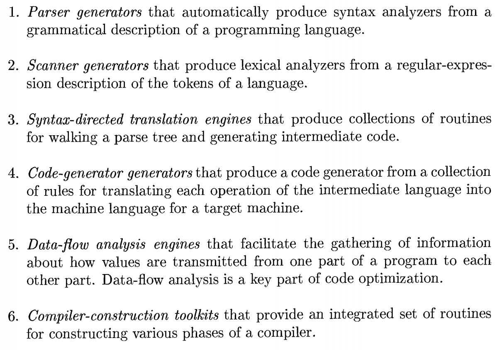

## Front end compilier.

- list of tools to help make compilers.

  

#### The first phase of a compilier has 3 general steps....

1. Scanner (lexer) -> is implemented with regualar expressions and Finite Automata.
2. Parsers -> are built using Grammers. The Grammer defines what is valid syntax for the language.
3. Semantic Analysis -> statements are meaningful only if their 'types' match or are defined make sense.
   - Compilier must link vaiables and statements from the parsed syntax with all the declared 'types'.
   - All of the declared variables go into a 'Symbol table' which stores its type, scope, etc...

If all three steps are passed, then an AST will be generated. If not, the compilier will produce and error message.
AST is also known as the 'Intermediate Representation'. An IR may take one of several forms: an in-memory data structure, or a special tuple- or stack-based code readable by the program.

Intermediate graph/tree structure allows for flow analysis and re-arrangement before creating a sequence of actual CPU instructions.
