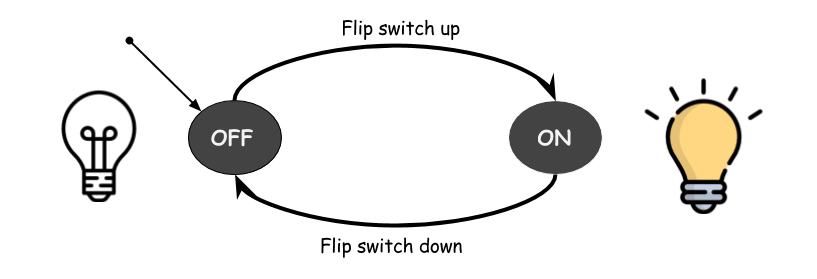

# Computation

-These are notes based on a youtube channel video series.
'Theory of Computation #01 Intro to TOC & Finite Automata | Examples' <br/>
<https://www.youtube.com/watch?v=Jbfto52zr0Q&list=PLEJxKK7AcSEEYrMd4G7Y3mjGlE651B7yc>

## Start by asking what is 'computation'?

- Computation is a 'process' or a means to solving a problem which can be executed on 'devices'.

  - a "device" can be anything from a computer to a piece of paper and pen. A stone tablet
    can be a means to solving a problem.(device)
  - The step by step instructions of this process to solving a problem is known as an "Algorithm".

<center><h2>Finite Automata</h2></center>

- In informal terms finite automaton (or finite state machine) is an abstract machine that has states and transitions between these states. It is always in one of its states and while it reads an input it switches from state to state. It has a start state and can have one or more end (accepting) states.

  'Finite Automata' is a model of a computation with a finite amount of memory or
  states. Which can be exeuted on any number of devices. Finite automata are used to recognize patterns of strings, regular expressions are used to generate patterns of strings. Each can be converted between the other. Regex to FS and FS to Regex.

  They describe the same languages. Not 'human' languages, but 'Formal'languages (set of strings accepted by some rule) They describe a particular form of language called **"Regular language"**.

  - Variables, Numbers, URL's, email, phone number can be described by Reg Lang.

  People prefer RegExspressions, but computers prefer Finite Autotomota. So there are programs that convert between the two.

```
ex) Electric switch.
      State is either 'on' or 'off'

```



    ```
    ex2) Fan regulator. (Not sure this is correct/needs more research)
    	Has 4 states which can be incrementally approached as low->med->High-off states. With
    	push operations in 'clockwise' and 'ani-clockwise' directions. Each state can be represented
    	as 1 of any 4 possible 2 digit binary values.
    		00 <-> 10 <-> 11 <-> 01
    	Processing a stream of Binary values. State represented as two bits...by shifting over to next
    	bit in the stream will represent a change in state.
    		|10|110 ==> 1|01|10 ==> 10|11|0 ==> 101|10|.....
    		    |           |           |          |
    		    |           |           |          |
    		   off         low         med        high
    ```
