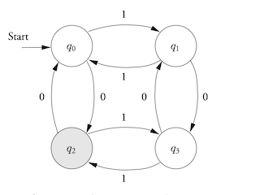

# Computation

**A Language** is ...just a set of strings.

Alphabet: finite set of symbols<br/>
String: sequence of symbols from that alphabet

- Grammers, FSA , Regex ...are some of the tools for recognizing a language.

-These are notes based on a youtube channel video series.
'Theory of Computation #01 Intro to TOC & Finite Automata | Examples' <br/>
<https://www.youtube.com/watch?v=Jbfto52zr0Q&list=PLEJxKK7AcSEEYrMd4G7Y3mjGlE651B7yc>

## Start by asking what is 'computation'?

- Computation is a 'process' or a means to solving a problem which can be executed on 'devices'.

  - a "device" can be anything from a computer to a piece of paper and pen. A stone tablet
    can be a means to solving a problem.(device)
  - The step by step instructions of this process to solving a problem is known as an "Algorithm".

<center><h2>Deterministic Finite Automata</h2></center>

- An automaton (Automata in plural) is an abstract self-propelled computing device which follows a predetermined sequence of operations automatically

- In informal terms finite automaton (or finite state machine) is an abstract machine that has states and transitions between these states. It is always in one of its states and while it reads an input it switches from state to state. It has a start state and can have one or more end (accepting) states. Can be used to accept string values or map values to diff values. It's a mapping network of finite available states which 'language syntax value representations/entities' can traverse the 'machine' (computation entity) and ultimatly produce an intended outcome. In some cases that is 'acceptence' by the machine or value transistion/shift/translation.

Finite Automata can be represented as **graphs** or **tables**....they represent the same idea.

'Inductive' proofs are a useful technique to prove FA.

### an **'Alphabet'** is a finite set of strings.

- ASKII or Unicode for example.
- When learning FA some people like to limit the alphabet to a 'binary alphabet'.
  - { 0, 1 }

a **String** is a sequence of the symbols of a given alphabet.

- Alphabet will be <sub>&Sigma;</sub>

and a string is a sequence for which **each element** is a member of <sub>&Sigma;</sub>

<sub>&Sigma;\*</sub> = set of **all** strings over the alphabet <sub>&Sigma;</sub>

The empty string is denoted by epsilon <sub>&epsilon;</sub>

example....the binary alphabet.

- { 0, 1 }\* = { sub>&epsilon;</sub> , 0 , 1 , 00, 01 , 10 , 11, 000, 001 ......}

### Formalism for defining languages.

1. Q : finite set of states.
2. <sub>&Sigma;</sub> : an input alphabet.
3. <sub>&delta;</sub> : Transition function.
4. q<sub>0</sub> : start state.
5. F : set of Final states.

### What makes an automaton work is the Transition function.

- It takes two arguments
  1. A State (q)
  2. input symbol (a).
- <sub>&delta;</sub>(q, a);
  - the function delta is the state that the DFA goes to when it is in state q and it recieves input a...and is **total**...meaning it has a value for every state and symbol. If moving on to the next state is not wanted then you need to introduce a 'dead state'.
    - **dead state** is a 'not accepting' state that has a transition back to itself for every input symbol.

'Finite Automata' is a model of a computation with a finite amount of memory or
states. FSA can be exeuted on any number of devices. Finite automata are used to recognize patterns of strings, regular expressions are string patterns used to generate FSA. Each can be converted between the other. Regex to FS and FS to Regex.

**Deterministic Machines** (DFA) mean there is an un-ambiguous mapping of a string element being processed to a definite state change. A string element being processed will never have more than one option in the next state change.
In a 'Deterministic Finite State Machine', the available 'states' are fixed. (allocated memory in the machine is fixed..perhapes it can live on the 'stack'...i'm not sure).

We can say that a language that is accepted by a FSM is the set of alphanumeric values that the FSM will accept. Meaning that the FSM defines what language is by its 'computational acceptence' of it which is then regaurded as being Regular or FSM approved!!! I'm assuming then that a FSM can catch syntax errors in IDE's.

Regular expressions are patterns of text for which a FSM will accept. Specified pattern of the elements from a regular language from which a FSM will process and accept. Some Regex engines are implemented as Finite State Automota...grep, awk, and sed. These build a state machine based on the Regex pattern and use it to process the input strings. They uses the 'Thompson algorithm' to convert the regex expression into a NFA (at least the Unix grep..not sure).

```
DFSM = M
Q = Set of States of M
Sigma = alphabet used for the strings
Delta = transition function

Q x Sigma -> Q ..... state takes a string and moves into another state.

```

They describe the same languages. Not 'human' languages, but 'Formal'languages (set of strings accepted by some rule) They describe a particular form of language called **"Regular language"**. A language is regular if there is a Deterministic Finite Automota for it....

If a language set A is regualr and defined by Machine_1 and a set B is regular and defined by Machine_2...the **'Union'** of A and B will also be a regular language. In this instance the DFSM of each language set run in parallel while processing a given input and for the union to also be regular at least one of the Machines must end in an accepting state. Like the 'or' clause in logic

For an **'Intersection'** of the two sets....(like the 'and' clause in logic)...both machines running in parallel must end in an accept state.

DFA's can handle Union and Intersection of 2 seperate Regular languages by processesing a single string is parrallel. A single string can be accepted by the Automata either by 'or' or 'and' acceptence state results. What we cannot do in DFA's is to 'concatenate' 2 diff strings from diff Regualr languages. For that we need a **NFA**.

- Variables, Numbers, URL's, email, phone number can be described by Reg Lang.

People prefer RegExpressions, but computers prefer Finite Autotomota. So there are programs that convert between the two.

```
ex) Electric switch.
      State is either 'on' or 'off'

```


```
    ex2) Fan regulator.
    	Has 4 states which can be incrementally approached as low->med->High-off states. With
    	push operations in 'clockwise' and 'ani-clockwise' directions. Each state can be represented
    	as 1 of any 4 possible 2 digit binary values.
    		00 <-> 10 <-> 11 <-> 01
```



```
ex3) Machine that accepts only strings divisable by 4 It just so happens that if any Binary value ends in 2 consecutive 0's...that binary value is divisable by 4. So we need a Machine to accept only strings that end in two 0's as it's final state.

Processing a stream of Binary values. State represented as two bits...by shifting over to next
    	bit in the stream will represent a change in state. Feed string 10100 into the machine.
    		|10|100 ==> 1|01|00 ==> 10|10|0 ==> 101|00| <-- end of string
    		    |           |           |          |
    		    |           |           |          |
    		   rej         rej         rej        accept

			   If state ends in anything other than 00 it is rejected. This string is accepted.

```
