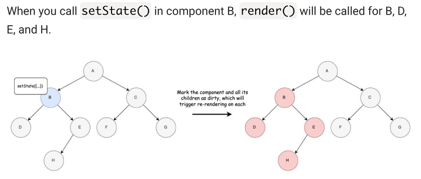

### React internals.

This will act as my notePad for learning and understanding how the React Architecture works.
This is more about what the current philosophy reguarding building UI's is at right now and where it might be
going into the future.

- React fallows the 'Observable' software design pattern(1 of the 23 GangOfFour design patterns).This design is
  typically implemented for 'Event driven distributed systems'. Such as blockchain and dist databases... but also is used
  for user input data such as keyboard events. Many pattens implement background threads to listen for events using the
  system mechanisms provided by the Kernal.

- React abstracts away event handling, attribute manipulation, manual DOM updates for the developer. We only need
  to concern ourselves with state change upsdates to any components.

- **The Virtual DOM**
  The virtual dom is representation of the actual DOM tree created by the browser. It is implemented
  in Javascript on top of the API's provided by the browser.

  React elements are 'plain objects' that describe the tree and represet DOM nodes.

  The Browswer takes an HTML file and parses it into a tree of nodes.

  React’s diffing algorithm allows developers to author user interfaces in a declarative way, without 
  worrying about how to handle updates when the backing data changes. 
  rendering a component and updating the DOM for that component are two separate steps in the lifecycle.

  When the 'setState' function is called in a component...that component and all of it's children are marked as 'dirty'.
  React then executes the render() function for each of the 'dirty' components.
